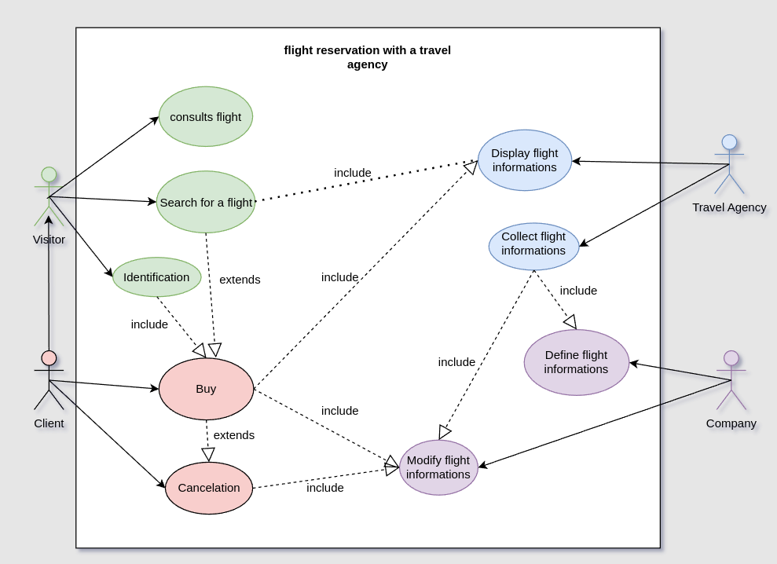
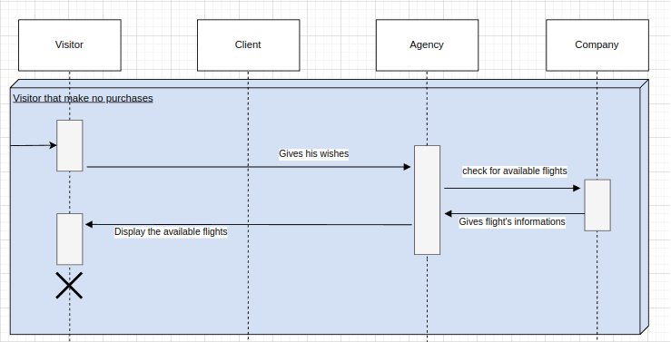
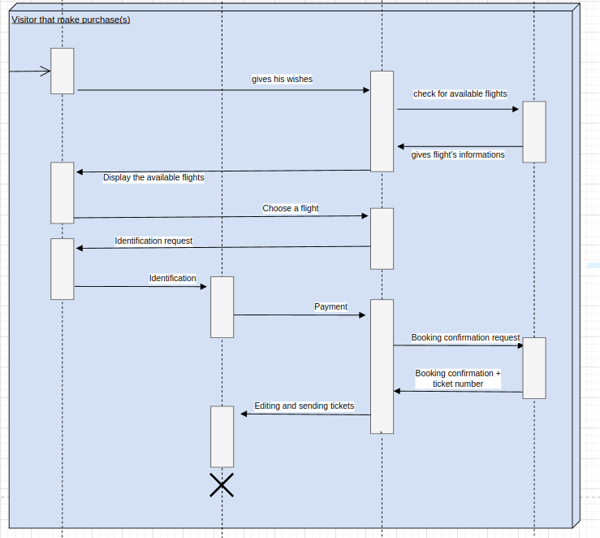
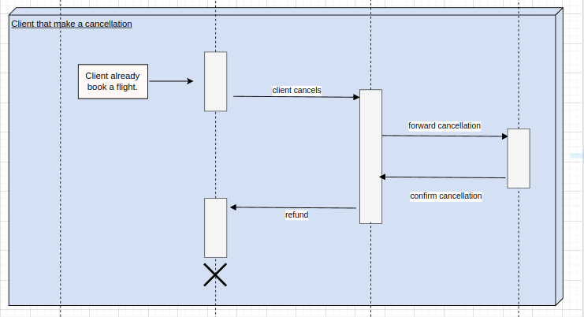
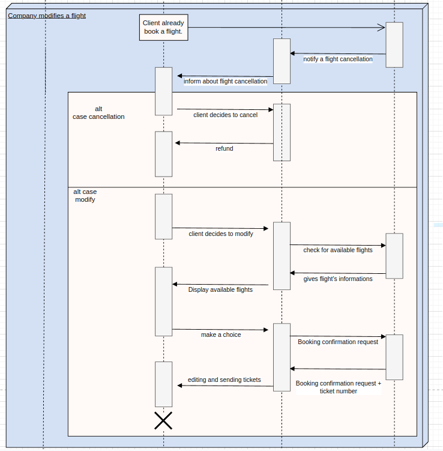

# Keke Voyage

## Contexte 

Votre client, une agence de voyages, souhaite proposer la possibilité de réserver en ligne des billets d'avion à leurs clients.

Votre mission est de concevoir à l'aide du standard UML la modélisation de la plateforme.

## Conception 

Afin de mener à bien notre conception d'application, nous adpotons une stratégie en différentes étapes : 

1) Réalisation des règles de gestion
2) Réalisation du diagramme des cas d'utilisation (use case diagram)
3) Réalisation d'un diagramme d'activité
4) Réalisation d'un Diagramme de séquence
5) Réalisation d'un diagramme de classe
6) Rédaction du dictionnaire de donnée
7) Réalisation du MCD
8) Transformation du MCD en MLD
9) Transformation du MLD en MPD

### 1. Réalisation des règles de gestion 

Les règles de gestion sont au plus haut de l'abstraction.
La définition des règles de gestion est une étape nécessaire avant toute chose car elle permet de définir les règles que suit le métier qui sera conceptualisé dans notre application. 

L'application finale devra respecter toutes ces règles de gestion et celles-c serviront de règles directrices dans l'élaboration de notre application. 

#### Client
Le client consulte l'agence de voyage.
- Le client est constitué d'un nom, d'un prénom, d'un numéro de téléphone, d'une adresse mail. Celui-ce peut s'authentifier ou non.
- Le client renseigne ses souhaits : aéroport de départ souhaitée, aéroport d'arrivée souhaitée, date de départ, date d'arrivée souhaitée.
- Le client peut réserver plusieurs vols.
- Le client peut réserver pour des passagers.
- Le client choisit son numéro de siège.
- Le client paie sa réservation.
- Le client reçoit une facture/confirmation par mail.
- Le client peut annuler sa réservation.

#### Agence de voyage
L'agence de voyage consulte les différents compagnies afun de proposer des solutions au client.
- Récupère les infomations du client.
- Récupère les informations de vols auprès des différentes compagnies.
- L'agence calcule les potentielles escales.
- Propose au client les différents vols disponibles.
- Récupère le choix du client et confirme la réservation auprès de la compagnie.
- La compagnie définit un numéro de réservation.
- La réservation peut être composée d'un ou plusieurs vols (escales) et est composée des informations de vols pour chacun.

#### Compagnie aérienne
La compagnie est le festionnaire des différents vols.
- Définit en amont les informations de vol.
- La compagnie valide ou refuse la réservation.
- La compagnie peut annuler le vol.
- La compagnie aérienne fournit les informations nécessaire en cas d'escale : aéroport d'escale, heure d'arrivée, heure de départ.

#### Vol
Le vol est défini par la compagnie.
- Une place réservé devient occupée, sinon elle est libre.
- Un vol a un prix, un numéro de vol, un horaire de départ (date + heure) et un horaire d'arrivée.
- Un vol est composé de places, disponibles ou non.

#### Ville
- Une ville peut posséder un ou plusieurs aéroport.

### 2. La réalisation du diagramme des cas d'utilisation

La deuxième étape de notre projet de conceptualisation d'application passe par un autre niveau d'abstraction: le diagramme des cas d'utilisation ou _use case_. 

Le diagramme des cas d'utilisation est une représentation graphique des besoins de l'utilisateur et des différentes actions des acteurs. 

Le use case diagram nous sert ici à décrire les fonctionnalités de notre application. 

### 3. Réalisation du diagramme d'activité

### 4. Réalisation du diagramme de séquence

4 diagrammes de séquence ont étés réalisés suivant les principales activités impliquant le client et notre application : 

* Cas d'une simple visite sans achat
   

* Cas d'une visite avec achat
   

* Cas d'une demande d'annulation par le client

* 1) Cas d'une annulation par la compagnie de vol

### 5. Réalisation d'un diagramme de classe

### 6. Rédaction du dictionnaire de donnée

Une première version du dictionnaire a été esquissée lors de notre modélisation du diagramme de séquence : 

(((((insérer tableau premier dictionnaire)))))

Dans un second temps, celui-ci a été complété lors de la modélisation de notre diagramme de classe : 

(((insérer deuxième version dictionnaire)))

