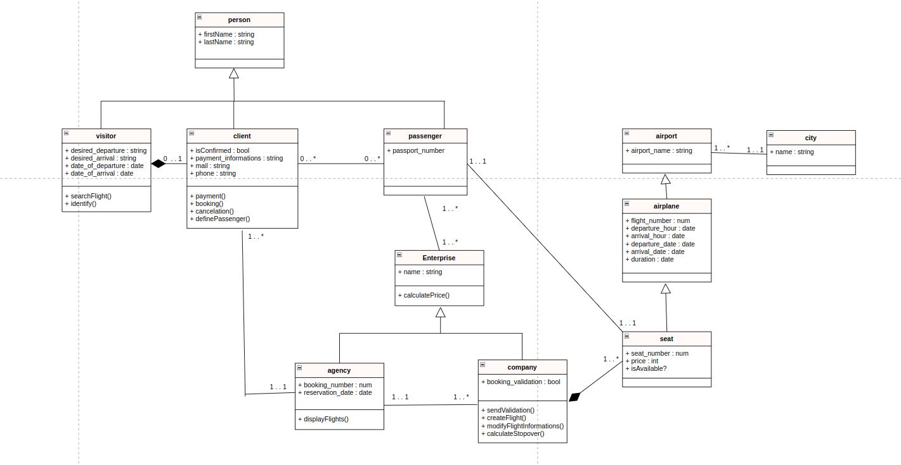

# Keke Voyage

## Contexte 

Votre client, une agence de voyages, souhaite proposer la possibilité de réserver en ligne des billets d'avion à leurs clients.

Votre mission est de concevoir à l'aide du standard UML la modélisation de la plateforme.

## Conception 

Afin de mener à bien notre conception d'application, nous adpotons une stratégie en différentes étapes : 

1) Réalisation des règles de gestion
2) Réalisation du diagramme des cas d'utilisation (use case diagram)
3) Réalisation d'un diagramme d'activité
4) Réalisation d'un Diagramme de séquence
5) Réalisation d'un diagramme de classe
6) Rédaction du dictionnaire de donnée
7) Réalisation du MCD
8) Transformation du MCD en MLD
9) Transformation du MLD en MPD

### 1. Réalisation des règles de gestion 

Les règles de gestion sont au plus haut de l'abstraction.
La définition des règles de gestion est une étape nécessaire avant toute chose car elle permet de définir les règles que suit le métier qui sera conceptualisé dans notre application. 

L'application finale devra respecter toutes ces règles de gestion et celles-c serviront de règles directrices dans l'élaboration de notre application. 

#### Client
Le client consulte l'agence de voyage.
- Le client est constitué d'un nom, d'un prénom, d'un numéro de téléphone, d'une adresse mail. Celui-ce peut s'authentifier ou non.
- Le client renseigne ses souhaits : aéroport de départ souhaitée, aéroport d'arrivée souhaitée, date de départ, date d'arrivée souhaitée.
- Le client peut réserver plusieurs vols.
- Le client peut réserver pour des passagers.
- Le client choisit son numéro de siège.
- Le client paie sa réservation.
- Le client reçoit une facture/confirmation par mail.
- Le client peut annuler sa réservation.

#### Agence de voyage
L'agence de voyage consulte les différents compagnies afun de proposer des solutions au client.
- Récupère les infomations du client.
- Récupère les informations de vols auprès des différentes compagnies.
- L'agence calcule les potentielles escales.
- Propose au client les différents vols disponibles.
- Récupère le choix du client et confirme la réservation auprès de la compagnie.
- La compagnie définit un numéro de réservation.
- La réservation peut être composée d'un ou plusieurs vols (escales) et est composée des informations de vols pour chacun.
- L'agence de voyage définit un prix composé du prix des places additionné à sa commission.

#### Compagnie aérienne
La compagnie est le festionnaire des différents vols.
- Définit en amont les informations de vol.
- La compagnie valide ou refuse la réservation.
- La compagnie peut annuler le vol.
- La compagnie aérienne fournit les informations nécessaire en cas d'escale : aéroport d'escale, heure d'arrivée, heure de départ.

#### Vol
Le vol est défini par la compagnie.
- Une place réservé devient occupée, sinon elle est libre.
- Un vol a un prix, un numéro de vol, un horaire de départ (date + heure) et un horaire d'arrivée.
- Un vol est composé de places, disponibles ou non.

#### Ville
- Une ville peut posséder un ou plusieurs aéroport.

### 2. La réalisation du diagramme des cas d'utilisation

La deuxième étape de notre projet de conceptualisation d'application passe par un autre niveau d'abstraction: le diagramme des cas d'utilisation ou _use case_. 

Le diagramme des cas d'utilisation est une représentation graphique des besoins de l'utilisateur et des différentes actions des acteurs. 

Le use case diagram nous sert ici à décrire les fonctionnalités de notre application. 

### 3. Réalisation du diagramme d'activité

Un diagramme d'activité dans sa forme la plus épurée est réalisé afin de représenter le parcours client.

### 4. Réalisation du diagramme de séquence

4 diagrammes de séquence ont étés réalisés suivant les principales activités impliquant le client et notre application : 

* Cas d'une simple visite sans achat
   

* Cas d'une visite avec achat
   

* Cas d'une demande d'annulation par le client

* 1) Cas d'une annulation par la compagnie de vol

### 5. Réalisation d'un diagramme de classe

Le diagramme de classe permet de représenter les différents acteurs de notre application selon les principes de l'orienté Objet. Sa forme est volontairement complexe de façon à ce que l'ajout de fonctionnalités ou d'acteurs à l'avenir soit aisé. 

Une première version a été réalisée, suivant nos séquences : 

Cependant, celui-ci n'est pas orienté objet et ne suit pas les formes normales.
L'ajout de classes abstraites nous permet d'obtenir ce diagramme : 

. 

Ce diagramme s'approche de notre version finale. L'ajout d'une classe passager était nécessaire à la bonne communication entre nos classes.

La version finale, propre: 

### 6. Rédaction du dictionnaire de donnée

Une première version du dictionnaire a été esquissée lors de notre modélisation du diagramme de séquence, puis progressivement modifiée lors de notre modélisation du diagramme de classe : 

| Nom de la donnée  | Description                      | Format | Type        |          | Règles de calcul        |
|-------------------|----------------------------------|--------|-------------|----------|-------------------------|
|                   |                                  |        | Elementaire | Calculée |                         |
| Client            |                                  |        |             |          |                         |
| client_firstname  | First name of the client         | string | x           |          |                         |
| client_lastname   | Last name of the client          | string | x           |          |                         |
| client_mail       | mail of the client               | string | x           |          |                         |
| client_phone      | client phone number              | string | x           |          |                         |
| Réservation       |                                  |        |             |          |                         |
| desired_departure | desired departure city           | string | x           |          |                         |
| desired_arrival   | desired departure city           | string | x           |          |                         |
| date_of_departure | Desired departure date           | date   | x           |          |                         |
| date_of_arrival   | Desired arrival date             | date   | x           |          |                         |
| isConfirmed       | Booking reservation              | bool   | x           |          |                         |
| passenger         |                                  |        |             |          |                         |
| passenger_name    | name of the passenger            | string | x           |          |                         |
| passport_number   | number of the passport           | num    | x           |          |                         |
| ticket_number     | number of the ticket             | string | x           |          |                         |
| Agency            |                                  |        |             |          |                         |
| commission        | price of the agency commission   | string | x           |          |                         |
| agency_name       | name of the agency               | string | x           |          |                         |
| price             | price of the booking             | num    |             | x        | seat_price + commission |
| airplane          |                                  |        |             |          |                         |
| flight_number     | Number of the flight             | num    | x           |          |                         |
| company_name      | name of the company              | string | x           |          |                         |
| departure_hour    | hour of departure for the flight | date   | x           |          |                         |
| arrival_hour      | hour of arrival for the flight   | date   | x           |          |                         |
| departure_date    | date of the departure            | date   | x           |          |                         |
| arrival_date      | date of the departure            | date   | x           |          |                         |
| departure_airport | airport of departure             | string | x           |          |                         |
| arrival_airport   | airport of arrival               | string | x           |          |                         |
| seat              |                                  |        |             |          |                         |
| seat_number       | number of the seat               | num    |             |          |                         |
| isAvailable ?     | is the seat available ?          | bool   | x           |          |                         |
| seat_price        | price for the seat               | num    | x           |          |                         |

### 7. Réalisation du MCD 

